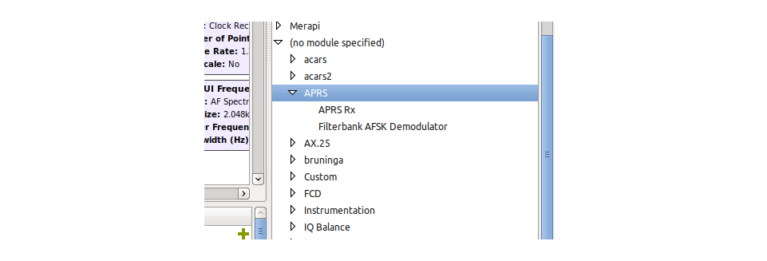
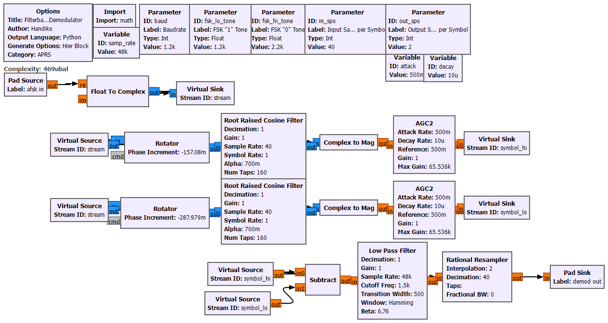
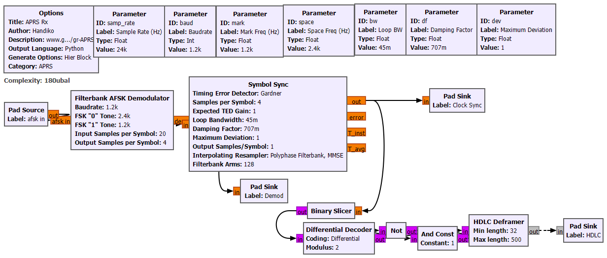
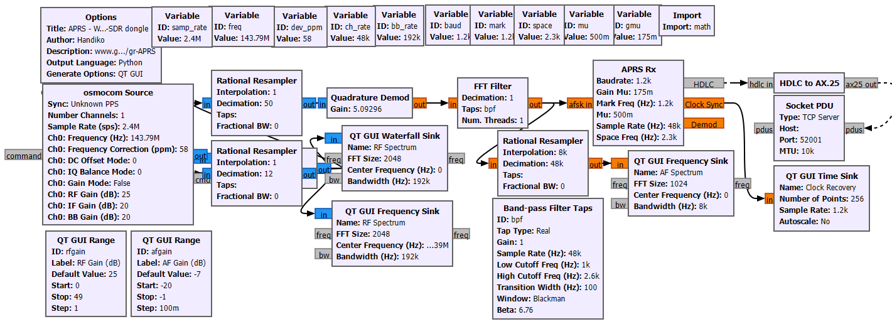
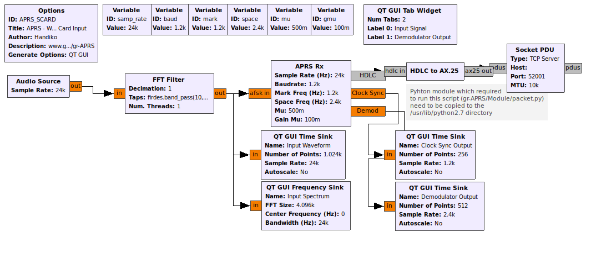
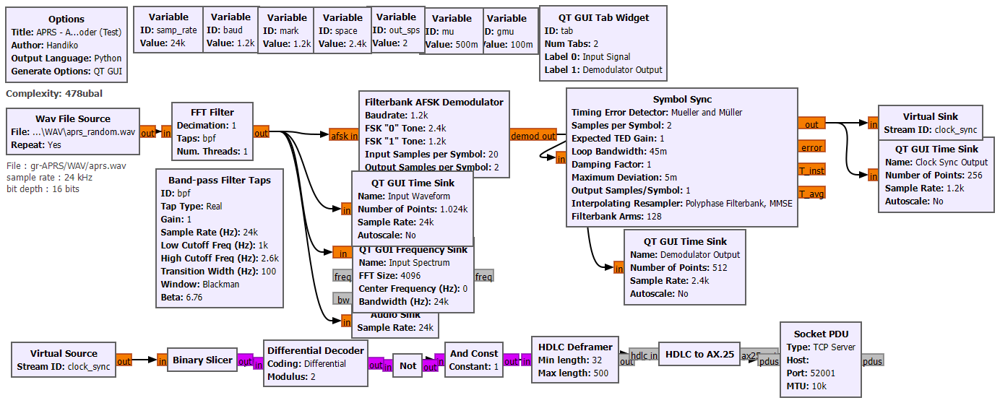

# gr-APRS - A GNU Radio Block for Receiving APRS
GNU Radio Hierarchical Block(s) to Test and Receive APRS Packet (with examples). Tested on **GNU Radio v3.10**.

## (-- FINALLY UPDATED AFTER 8 YEARS !!! --)
* All of the codes are rebuilt with GNU Radio V3.10 and python3
* The Python files used in the Python Block are consolidated into a single file.

---

## Dependency
* **GNU Radio**. Please check out [https://www.gnuradio.org/](https://www.gnuradio.org/) or [Their GitHub repo](https://github.com/gnuradio/gnuradio)

## Installations
This OOT Module is built upon the GNU Radio hierarchical block scheme. The hierarchical block itself is "transparently" built graphically / visually using GRC. The hier blocks are provided in the gr-APRS/HierBlock folder.
Installation steps :
* `git clone https://github.com/handiko/gr-APRS.git`
* `cd gr-APRS/HierBlock/.`
* `gnuradio-companion AFSK_Demod.grc` **AFSK_Demod.grc** should be installed **first**.
* **Click RUN** (F6) button on GNU Radio companion (It will do nothing in the foreground, since it will just build and install the Hier Block silently). Then **Close**.
* `gnuradio-companion APRS_Rx.grc` **APRS_Rx.grc** should be installed **after** AFSK_Demod.grc.
* Again, **Click RUN** (F6) button and then Close.
* **Open the GNU Radio**. The new Hier Block will be listed under the APRS module.

Finish, and now you can open GRC files on **gr-APRS/Examples/** or **gr-APRS/TestScripts/** and run them.

### About the HDLC to AX.25 block
This block, which functions to convert HDLC data into TNC2 APRS formats, is constructed from the "Python Block," which is native to the GNU Radio Companion. To build one yourself:
* From the GNU Radio Core module, under Misc, add a Python Block into your flowgraph.

* Double-click that block to open the properties and then click Open in Editor. If you then asked about which editor to choose, just select the default or any editor you prefer.
* In the editor, copy and paste python code from **gr-APRS/Module/epb.py**, save, close, and hit OK.
* Now your Python Block should be turned into HDLC to AX.25 Block, have message i/o ports which are labelled as "hdlc in" and "ax25 out".

## Hier Blocks
All the hier blocks are constructed graphically using GNU Radio Companion. AFSK Demod hier block is required by the APRS Rx hier block (hier block which contains another hier block within), so it should be installed first.

### AFSK Demod

### APRS Rx

## Examples
There are some grc examples included in **gr-APRS/Examples** and **gr-APRS/TestScripts** folder. WAV files are also included in the **gr-APRS/WAV** for testing purposes.

A Few notes:
* AFSK Demod hier block (Filterbank AFSK Demodulator) is recommended to run with input samples per symbol (**integer**) of at least 20 and must be **a value of input sample rate divided by baudrate** (**integer**). For example, at baudrate of 1200baud, if you run at the minimum recommended samples per symbol of 20, then the input sample rate must be 24kHz (24kHz / 1200baud = 20 sps).
* The output of the APRS decoder (HDLC to AX25 block) is sent to the **Socket PDU Block**. To examine this output, you can open a terminal and run `telnet localhost 52001`. The image below shows the output using the terminal, where the transmitted messages are some random strings under experimental data type (`,` data type) for testing purposes.

### APRS RX RTL
From **gr-APRS/Examples/APRS_RX_RTL.grc**. This example utilizes the low-cost RTL SDR dongle for receiving the APRS signal on 144.390 Mhz (for usage on another frequency, please change the frequency in the grc).

### APRS SCARD
From **gr-APRS/Examples/APRS_SCARD.grc**. This example utilizes the onboard sound card for use with a VHF Radio receiver. Audio from the Radio SPK output should be fed into the MIC input of your soundcard.

### APRS AFSK Complete WAV
From **gr-APRS/TestScripts/APRS_AFSK_Complete_WAV.grc**. These examples will decode AFSK audio files, which are included in **gr-APRS/WAV**. This example is mainly for testing purposes (for example, to find the best values of Mu and Gain Mu).

## TODO
* Bundle up all the codes using gr_modtool
* Optimizing AFSK Demodulation and Clock Sync process
* Tidy up this README file a bit :)

## Acknwoledgement
* [WB2OSZ](https://github.com/wb2osz/direwolf) for which the AFSK Demod scheme is pretty much based on their excellent work.
* [Bob Bruninga](https://github.com/tkuester/gr-bruninga) and
* [Dani Estevez](https://github.com/daniestevez/gr-satellites) for the clock synchronization method.

## Contributing
1. Fork it [https://github.com/handiko/gr-APRS/fork](https://github.com/handiko/gr-APRS/fork)
2. Create new branch (`git checkout -b add-blah-blah`)
3. Do some editing / create a new feature
4. Commit your works (`git commit -m "Adding some blah blah blah.."`)
5. Push to the branch (`git push -u origin add-blah-blah`)
6. Create a new Pull Request

---
